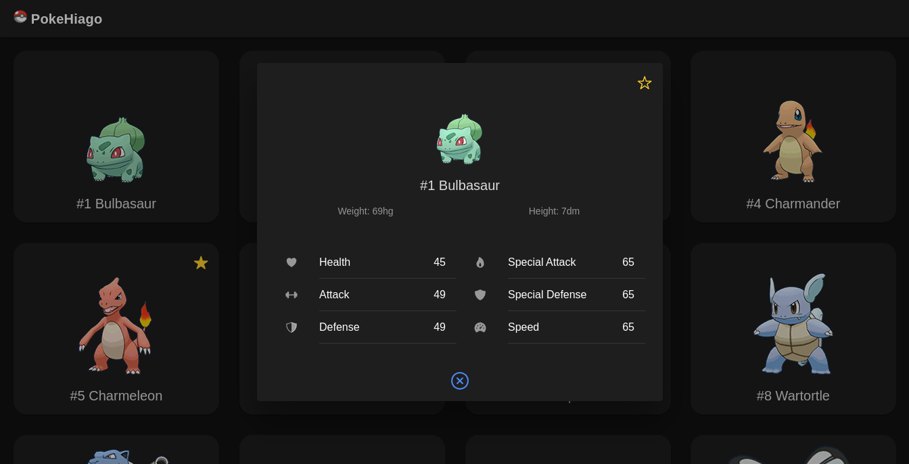

# PokeHiago

Um site que permite listar os Pokémons existentes na API [PokeAPI](https://pokeapi.co/), favoritá-los e visualizar detalhes como peso, altura e estatísticas de batalha.

## Getting Started

Esta seção descreve os pré-requisitos e o processo de instalação para executar o projeto localmente.

### Pré-requisitos

Antes de começar, certifique-se de ter instalado os seguintes itens:

- [Node.js](https://nodejs.org/) v18
- [Ionic Framework](https://ionicframework.com/) v7.2
- [Angular](https://angular.io/) v17

### Instalação

Siga estas etapas para instalar e executar o projeto localmente:

1. Clone o repositório:
```
$ git clone https://github.com/HiagoVini23/poke-hiago.git
```
2. Instale as dependências dentro da pasta 'frontend':
```
$ npm install
```
3. Inicie o servidor de desenvolvimento:
```
$ ionic serve
```
## Estrutura de Pastas do Projeto

- **src**: Diretório principal do código-fonte do aplicativo Ionic.
  - **app**: Diretório que contém todas as páginas, componentes e módulos.
    - **services**: Diretório que contém as funções que acessam a PokeAPI.
    - **home**: Página que lista os pokémons.
    - **details**: Página que lista os detalhes do pokémon selecionado.
  - **assets**: Diretório onde contém o logo, fotos dos pokémons e fotos utilizadas no README.md.

## Imagens

- Página de listagem dos Pokémons:

| Mobile | Web |
|--------|-----|
|  |  |

- Página de detalhe de um Pokémon:

| Mobile | Web |
|--------|-----|
|  |  |
