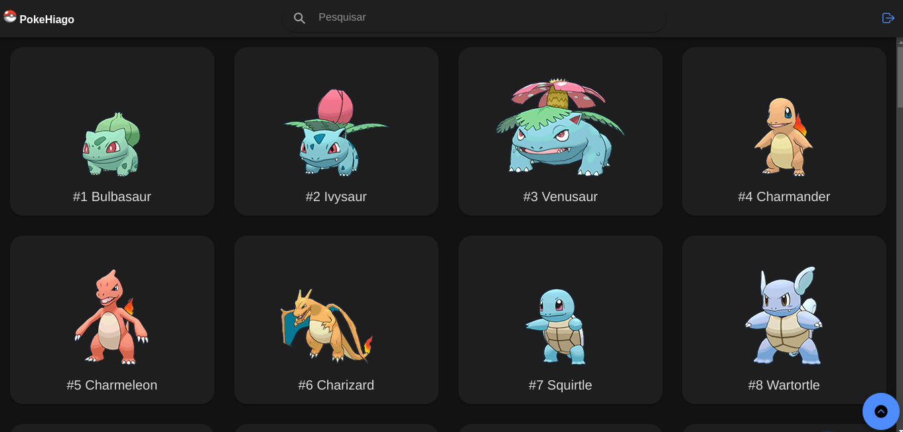

# PokeHiago

PokeHiago é uma plataforma interativa que permite criar usuários e explorar detalhadamente o universo Pokémon. Utilizando a API [PokeAPI](https://pokeapi.co/), o site lista todos os Pokémons, permitindo favoritá-los e visualizar informações como peso, altura e estatísticas de batalha. Qualquer pessoa pode se cadastrar de forma segura, com senhas criptografadas por bcrypt e autenticação via tokens JWT. O backend, desenvolvido em NodeJS, acessa a [PokeAPI](https://pokeapi.co/) e o banco de dados MySQL, criando rotas para o frontend. Desenvolvido em Ionic e Angular, o frontend gerencia a interação com o usuário, proporcionando uma experiência fluida e envolvente.

## Getting Started

Esta seção descreve os pré-requisitos e o processo de instalação para executar o projeto localmente.

### Pré-requisitos

Antes de começar, certifique-se de ter instalado os seguintes itens:

- [Node.js](https://nodejs.org/) v18
- [Ionic Framework](https://ionicframework.com/) v7.2
- [Angular](https://angular.io/) v17
- [MySQL](https://www.mysql.com/) v8

### Instalação

Siga estas etapas para instalar e executar o projeto localmente:

1. Clone o repositório:
```
$ git clone https://github.com/HiagoVini23/poke-hiago.git
```
2. Instale as dependências dentro da pasta 'frontend':
```
$ npm install
```
3. Em src/environment.ts coloque a referência ao backend local e coloque seus valores entre os '<>':
```
$ backend: 'http://localhost:<porta>'
```
4. Inicie o frontend:
```
$ ionic serve
```
5. Instale as dependências dentro da pasta 'backend':
```
$ npm install
```
6. Crie as váriveis de ambiente (arquivo .env) abaixo na raiz do backend e coloque seus valores entre os '<>':
```
BACKEND_PORT=<porta>
ACCESS_TOKEN_SECRET=<seuToken>
DATABASE_URL="<database>://<user>:<senha>@<endereço>:<porta>/<schema>"
```
7. Aplique as migrations para criar o banco e suas tabelas:
```
$ npx prisma migrate dev
```
8. Inicie o backend:
```
$ npm run dev
```

## Estrutura de Pastas do Projeto

### Frontend
- **src**: Diretório principal do código-fonte do aplicativo Ionic.
  - **app**: Diretório que contém todas as páginas, componentes e módulos.
    - **services**: Diretório que contém as funções que acessam o backend.
    - **home**: Página que lista os pokémons.
    - **details**: Página que lista os detalhes do pokémon selecionado.
    - **login/signup**: Página de login e cadastre-se
    - **utils**: Arquivos úteis para todo o app.
  - **assets**: Diretório onde contém o logo e fotos dos pokémons.
### Backend
- **prisma**: Diretório do Prisma ORM contendo o schema e o client.
- **src**: Diretório principal do código-fonte.
  - **controllers**: Lógica de controle para lidar com requisições e respostas da API.
  - **enum**: Definições de enums para tipos e constantes usados no projeto.
  - **middlewares**: Middlewares para manipulação e verificação de requisições.
  - **models**: Definições de modelos e esquemas de dados.
  - **routes**: Definições das rotas da API e suas associações com controllers.
  - **services**: Lógica de negócios e serviços de acesso aos dados.
  - **utils**: Utilitários e funções auxiliares.
  - **server.ts**: Arquivo de inicialização do servidor.

## Imagens

- Página de listagem dos Pokémons:

| Mobile | Web |
|--------|-----|
|  |  |

- Página de detalhe de um Pokémon:

| Mobile | Web |
|--------|-----|
|  |  |

- Página de Login

| Mobile | Web |
|--------|-----|
|  |  |

- Página de Cadastre-se

| Mobile | Web |
|--------|-----|
|  |  |

